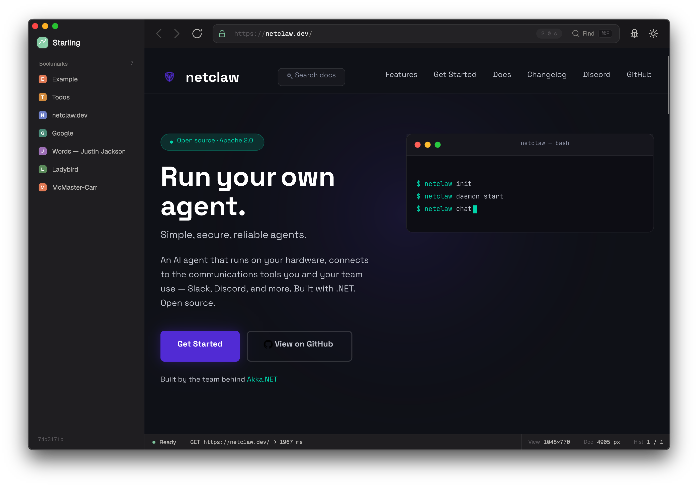

# Starling

Managed-first .NET 10 web browser. Built from primitives, no Chromium / Gecko / WebKit reuse.
Native interop is confined to one vetted seam (image codecs); everything
else — including paint — is pure-managed.



## Status — high-level buckets

Legend: ✅ shipped · 🟡 partial / actively iterating · ⚫ not started

| Bucket | Status | Notes |
|---|---|---|
| **HTML parsing** | ✅ | Tokenizer (html5lib 100%) + spec-compliant tree builder. |
| **DOM** | ✅ | Nodes, mutations, live collections, events. |
| **CSS** | 🟡 | Tokenizer, parser, selectors (incl. `:has`, pseudo-elements, modern pseudo-classes), cascade + layers, Values 4 math (`calc`/`min`/`max`/`clamp`), Color 4 spaces + gamut mapping, Media 5 + `@supports`, CSS Nesting, `revert`/`unset`, `@font-face` + WOFF/WOFF2, 216 PropertyIds. Further property/feature coverage ongoing. |
| **Layout** | 🟡 | Block + inline + inline-block (with BFC for block children and two-pass max-content shrink-to-fit), margin collapse, `margin: auto` centering, text-align, minimal table layout via UA-stylesheet inline-block cells, form controls visible by default, **Flexbox** (item generation, content-box sizing, nested flex, `inline-flex`) and **minimal CSS Grid**. Further flex/grid coverage ongoing. |
| **Paint** | ✅ | ImageSharp.Drawing 3 (pure-managed, SixLabors licensed via repo-root `sixlabors.lic`). DisplayList drives both headless and GUI. WebGPU compute target is the default; opt back to the CPU path with `STARLING_PAINT_BACKEND=imagesharp`. |
| **Networking** | ✅ | URL (WPT 100%), DNS, TCP, **TLS 1.3 via BouncyCastle** (an `SslStream` migration was reverted in `939f3a5` after a macOS TLS 1.3 issue — see [AGENTS.md](AGENTS.md)), HTTP/1.1 with keep-alive connection pool, gzip/brotli/deflate, redirects, RFC 6265bis cookies + PSL, WHATWG encoding labels (43/43 curated WPT subset), CCADB root store. `starling render https://example.com` is gated in CI. |
| **Image pipeline** | ✅ | OS-native codecs (`Starling.Codecs`: ImageIO on macOS, WIC on Windows, libjpeg/png/webp on Linux), `data:` URI support, accessible names for unrenderable ``/`<svg>`. |
| **JS engine** | 🟡 | Lex + parse (full ES2024 grammar) + bytecode compiler + register VM. Intrinsics (Object/Array/String/Number/Boolean/Symbol/BigInt/Math/JSON/Date/RegExp/Map/Set/WeakMap/WeakSet/WeakRef/Proxy/Reflect/ArrayBuffer/DataView/TypedArrays/Error), Promise + microtasks, async/await, **async generators** (incl. `for await…of`), classes (incl. **computed member keys** + `[Symbol.iterator]`), generators, destructuring (declarations, parameters, assignment, **and module-scope binding patterns**), **ES modules** (compile + loader + `<script type="module">`, **top-level await**, dynamic **`import()`** + **`import.meta`**), the **`arguments` object**, **rest parameters** (functions, arrows, method shorthand), **logical-assignment operators** (`??=`/`||=`/`&&=`), **object getter/setter shorthand**, named-function-expression self-reference, and `break`/`continue` across `try…finally` all work. Conformance is measured against **Test262** (`tools/fetch-test262.sh` + `Starling.Js.Test262.Tests`); the `test/language` suite currently passes **41.23%** (17955/43546, 2026-05-21). Still ahead: Test262 ≥ 80%. |
| **DOM bindings / Web APIs** | 🟡 | Node/Element/Document, EventTarget, full-grammar `querySelector`/`querySelectorAll`/`matches`/`closest`, `createElement`/`createTextNode`, `innerHTML`/`outerHTML`/`insertAdjacentHTML` (real HTML parse + serialize), `document.implementation.createHTMLDocument`, `classList`/`dataset`/`style`/`cloneNode`/`CustomEvent`, `fetch`, `XMLHttpRequest`, `crypto.getRandomValues`/`randomUUID`, timers, `requestAnimationFrame`, `local`/`sessionStorage`, cookies, `history`, `performance`, and Mutation/Resize/IntersectionObserver. Classic scripts honor `async`/`defer` ordering, dynamically injected `<script>`s execute, setting `src` on a `<script>` (via `setAttribute`/`.src`) runs HTML §4.12.1 "prepare a script" — fetch + execute + `load`/`error` so **deferred-bundle loaders work** — and JS geometry reads re-layout on DOM mutation. Real-world bundles run: a full Astro + Redux-Toolkit site (netclaw.dev) — including Google Analytics/gtag and Cloudflare Insights — renders with zero JS-engine errors, and the jQuery + Backbone + Marionette + YUI + Handlebars stack initializes. |
| **GUI shell** | 🟡 | Avalonia 12 (desktop: win/mac/linux). Chrome (Sidebar, UrlBar, StatusBar, WebviewPanel, Favicon, MiniLoadChart), DevTools panels (Console, Performance, Internals), `BrowserSession` (shared cookies + nav history across tabs), an in-process MCP server (`GuiMcpServer`) exposing browser-control tools to external agents. See [`src/Starling.Gui/`](src/Starling.Gui/). |
| **Telemetry / Aspire** | ✅ | Aspire AppHost orchestrates Gui + Headless; shared OTel + health-check bootstrap. |
| **Multi-process / sandbox / disk cache / HSTS** | ⚫ | M9+, not started. |

See [`browser-plan/13_MILESTONES.md`](browser-plan/13_MILESTONES.md) for the
milestone-by-milestone roadmap and [`tasks/INDEX.md`](tasks/INDEX.md) for the
work-package queue.

## Quickstart

You'll need:

- The [.NET SDK 10.0.100](https://dotnet.microsoft.com/) or newer.
- A Six Labors license key for the paint backend — a **free community license**
  takes a couple of minutes. See [Six Labors license](#six-labors-license) below.

```bash
dotnet restore
dotnet build
dotnet test
```

**Launch the browser.** `aspire run` brings up the full app — the Avalonia GUI
shell plus the headless renderer, orchestrated by Aspire (the dashboard URL
prints on stdout, typically <http://localhost:18888>). This is the desktop
browser pictured above.

```bash
aspire run
```

**Render a live site from the CLI.** The headless renderer fetches and paints a
real URL straight to a PNG:

```bash
# The built CLI binary is named `starling`.
dotnet run --project src/Starling.Headless -- render https://example.com -o example.png
```

`starling render https://example.com` is exercised in CI, and real-world bundles
render end-to-end — e.g. netclaw.dev (an Astro + Redux-Toolkit site, pictured
above). You can also point it at a local fixture for an offline smoke test (bare
paths are auto-normalized to `file://`):

```bash
dotnet run --project src/Starling.Headless -- render testdata/hello.html -o out.png
```

The CLI accepts bare filesystem paths as well as well-formed `file://` URLs.
`file:///absolute/path` works; `file://relative` does not (per the WHATWG URL
spec, the segment after `//` is the authority/host, not part of the path). Its
full shape is documented in [`browser-plan/02_PROJECT_SETUP.md`](browser-plan/02_PROJECT_SETUP.md#headless-cli-shape);
subcommands beyond `render` and `tokenize` are still incremental and may return a
"not yet implemented" message as they light up over the remaining milestones.

### Six Labors license

The engine paints via **ImageSharp.Drawing 3** — pure-managed, no native
graphics shim to build — which is commercially licensed by Six Labors. The repo
does **not** ship a license key (`sixlabors.lic` is gitignored), so each
contributor supplies their own. **Applying for a community license is quick and
easy: <https://licensing.sixlabors.com/>.** Save the key as `sixlabors.lic` in
the repository root and the build picks it up automatically (CI uses the
`SIXLABORS_LICENSE_KEY` secret instead).

## Repository layout

```
starling/
├── browser-plan/             # The entire design spec. Read 00_INDEX.md first.
├── src/                      # 14 engine modules + Headless CLI + Avalonia Gui (win/mac/linux)
├── Starling.AppHost/         # Aspire AppHost orchestrating Gui + Headless
├── Starling.ServiceDefaults/ # Shared OTel + health-check bootstrap for future services
├── tests/                    # One xUnit project per src/ module + an E2E project
├── bench/                    # BenchmarkDotNet harness
├── testdata/                 # Fixtures (HTML, golden PNGs, WPT subsets)
└── .github/workflows/        # CI: build+test on win/mac/linux, plus an interop-seam grep
```

## Interop policy

**Managed-first, native at vetted seams.** Native interop (`LibraryImport`) is
confined to one designated project — `Starling.Codecs` (image decode). Every
other engine project stays P/Invoke-free and takes no native dependency beyond
what the .NET BCL ships. The CI `lint` job greps the engine-project allowlist
(all engine projects *except* the Codecs interop project) to enforce this — see
[`02_PROJECT_SETUP.md`](browser-plan/02_PROJECT_SETUP.md#ci-matrix-githubworkflowsciyml).

## Working on Starling

Each subsystem has a focused doc in [`browser-plan/`](browser-plan/). For agent-facing work
packages with explicit inputs / outputs / acceptance, see
[`14_AGENT_TASKS.md`](browser-plan/14_AGENT_TASKS.md).

**New here?** Start with the design spec ([`browser-plan/00_INDEX.md`](browser-plan/00_INDEX.md))
and the engineering conventions in [`AGENTS.md`](AGENTS.md). Bug reports,
questions, and proposals are welcome via GitHub issues.

**Implementation agents:** start with [`AGENTS.md`](AGENTS.md) and the queue at
[`tasks/INDEX.md`](tasks/INDEX.md). Multiple agents can work in parallel — claim
an unblocked package via `./tasks/lib/claim.sh`, commit directly to `main` with
the wp id in the subject, leave a handoff-log entry on stop, and mark complete
via `./tasks/lib/claim.sh complete <wp-id>`. The full workflow is in
[`tasks/README.md`](tasks/README.md).

## License

TBD (set before public release).
